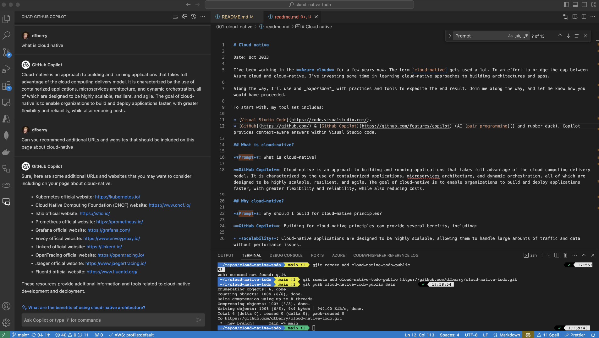

# Cloud native

Date: Oct 2023

I've been working in the **Azure cloud** for a few years now. The term `cloud-native` gets used a lot. In an effort to bridge the gap between Azure cloud and cloud-native, I'm investing some time in learning cloud-native approaches to building apps. 

Along the way, I'll use and _experiment_ with practices and tools to expedite the end result. Join me along the way, and let me know how you would have proceeded. 

To start with, my tool set includes:

* [Visual Studio Code](https://code.visualstudio.com/).
* [GitHub](https://github.com/) & [GitHub Copilot](https://github.com/features/copilot) (AI pair programming and rubber duck). Copilot provides context-aware answers within Visual Studio code. 

## What is cloud-native?

**Prompt**: What is cloud-native?

**GitHub Copilot**: Cloud-native is an approach to building and running applications that takes full advantage of the cloud computing delivery model. It is characterized by the use of containerized applications, microservices architecture, and dynamic orchestration, all of which are designed to be highly scalable, resilient, and agile. The goal of cloud-native is to enable organizations to build and deploy applications faster, with greater flexibility and reliability, while also reducing costs.

## Why cloud-native? 

**Prompt**: Why should I build for cloud-native principles?

**GitHub Copilot**: Building for cloud-native principles can provide several benefits, including:

* **Scalability**: Cloud-native applications are designed to be highly scalable, allowing them to handle large amounts of traffic and data without performance issues.
* **Resilience**: Cloud-native applications are designed to be resilient to failures, with built-in redundancy and failover mechanisms that ensure high availability and minimal downtime.
* **Agility**: Cloud-native applications are designed to be agile, with the ability to quickly adapt to changing business requirements and customer needs.
* **Cost-effectiveness**: Cloud-native applications can be more cost-effective than traditional applications, with the ability to scale up or down as needed and pay only for the resources used.
* **Portability**: Cloud-native applications are designed to be portable, with the ability to run on any cloud platform or infrastructure, making it easier to switch providers or move to a hybrid cloud environment.
* Overall, building for cloud-native principles can help you create more flexible, scalable, and resilient applications that can adapt to changing business needs and provide a **better experience for your customers**.
  
## How do I begin? 

**Prompt**: Where do I start on a new project for cloud-native?

**GitHub Copilot**: When starting a new project for cloud-native, there are several steps you can take to ensure that your application is designed for scalability, resilience, and agility. Here are some general steps you can follow:

  1. Choose a cloud platform: Select a cloud platform that meets your needs and provides the services and features you require. Some popular cloud platforms include Amazon Web Services (AWS), Microsoft Azure, and Google Cloud Platform (GCP).

  2. Define your architecture: Define the architecture of your application, including the components, services, and data stores that you will use. Consider using microservices architecture, which can help you build more scalable and resilient applications.

  3. Use containers: Use containers to package your application and its dependencies, making it easier to deploy and manage your application across different environments.

  4. Use container orchestration: Use a container orchestration platform like Kubernetes to manage your containers and ensure that your application is highly available and scalable.

  5. Use automation: Use automation tools like Ansible, Terraform, or CloudFormation to automate the deployment and management of your application.

  6. Use monitoring and logging: Use monitoring and logging tools to track the performance and health of your application, and to identify and troubleshoot issues.

  7. Use security best practices: Follow security best practices to ensure that your application is secure and protected from attacks.

By following these steps, you can build a cloud-native application that is designed for scalability, resilience, and agility, and that can provide a better experience for your users.

## First cloud-native project? 

**Prompt**: What is a simple project I can use for my first cloud-native project?

**GitHub Copilot**: A simple project that you can use for your first cloud-native project is a web application that allows users to create and manage to-do lists. This project can be built using a microservices architecture, with separate services for user authentication, to-do list management, and data storage.

**My perspective** 

A todo list is perfect, there are plenty of examples: 

* [Todo backend](https://todobackend.com/)
* [TodoMVC](https://todomvc.com/)
* [Swagger API spec](https://github.com/nickfun/learning-guardrail/blob/master/server.yaml)
* [Postman collection of tests](https://github.com/nickfun/learning-guardrail/blob/master/postman-collection.json)

## Architecture

**Prompt**: Can you suggest a beginning architecture of a todo app which is cloud-native?

**GitHub Copilot**: here's a beginning architecture for a cloud-native to-do app:

1. Frontend: A web or mobile app that allows users to create and manage to-do lists. The frontend can be built using a framework like React, Angular, or Vue.js.

2. API Gateway: An API gateway that serves as the entry point for the application and routes requests to the appropriate microservices. The API gateway can be built using a tool like Kong, Istio, or AWS API Gateway.

3. Authentication Service: A microservice that handles user authentication and authorization. This service can be built using a tool like Auth0, Okta, or AWS Cognito.

4. To-Do Service: A microservice that handles the creation, retrieval, updating, and deletion of to-do items. This service can be built using a framework like Express.js, Spring Boot, or Flask.

5. Database: A database that stores the to-do items and user information. The database can be a SQL or NoSQL database like MySQL, PostgreSQL, MongoDB, or DynamoDB.

6. Container Orchestration: A container orchestration platform like Kubernetes that manages the deployment and scaling of the microservices. Kubernetes can be used to deploy the microservices as Docker containers and manage their lifecycle.

7. Monitoring and Logging: A monitoring and logging solution like Prometheus, Grafana, or ELK Stack that provides visibility into the performance and health of the application.

By following this architecture, you can build a cloud-native to-do app that is designed for scalability, resilience, and agility, and that can provide a better experience for your users.

## Architecture roadmap

**Prompt**: Which piece of this architecture should I start with?

**GitHub Copilot**: 

* If you're just starting out with building a cloud-native to-do app, I would suggest starting with the To-Do Service microservice . This microservice is responsible for handling the creation, retrieval, updating, and deletion of to-do items, which are the core functionality of the application.
* You can start by building a simple REST API using a framework like Express.js, Spring Boot, or Flask, and then gradually add more features and functionality as you become more comfortable with the architecture. Once you have the To-Do Service up and running, you can then move on to building the other microservices, database, and container orchestration components of the architecture.

**My perspective** I want to plan out the roadmap a bit more concretely.

## Chronological roadmap

**Prompt**: Can you present the list of architectural elements in suggested chronological order?

**GitHub Copilot**: Sure, here's a list of the architectural elements in suggested chronological order:

  * To-Do Service: Start by building the To-Do Service microservice, which is responsible for handling the creation, retrieval, updating, and deletion of to-do items.

  * Database: Once you have the To-Do Service up and running, you can then add a database to store the to-do items and user information. You can choose a SQL or NoSQL database like MySQL, PostgreSQL, MongoDB, or DynamoDB.

  * Container Orchestration: After you have the To-Do Service and database in place, you can then add container orchestration using a platform like Kubernetes. This will allow you to manage the deployment and scaling of the microservices as Docker containers.

  * API Gateway: Once you have the microservices and container orchestration in place, you can then add an API gateway to serve as the entry point for the application and route requests to the appropriate microservices. You can use a tool like Kong, Istio, or AWS API Gateway.

  * Authentication Service: After you have the API gateway in place, you can then add an authentication service to handle user authentication and authorization. You can use a tool like Auth0, Okta, or AWS Cognito.

  * Frontend: Finally, you can add a web or mobile app as the frontend of the application, allowing users to create and manage to-do lists. You can build the frontend using a framework like React, Angular, or Vue.js.

By following this chronological order, you can gradually build a cloud-native to-do app that is designed for scalability, resilience, and agility, and that can provide a better experience for your users.

**My perspective**: I want an end-to-end experience (front-end talks to API which talks to back-end) faster so I'll rearrange these when I get to that point. 

## How to do this quickly? 

**Prompt**: What can help me build a cloud-native application as fast as possible while learning the principles of cloud-native?

**GitHub Copilot**:  You can use ChatGPT, GitHub Copilot, or any other intelligence to help you build a cloud-native application as fast as possible while learning the principles of cloud-native. These tools can provide suggestions and guidance on how to implement cloud-native principles in your application, and can help you automate certain tasks to speed up the development process. However, it's important to note that while these tools can be helpful, they should not be relied on exclusively. It's still important to have a solid understanding of cloud-native principles and best practices, and to take the time to design and implement your application in a way that is scalable, resilient, and secure.

## How do I learn the principles and practices? 

**Prompt**: Can you suggest how I learn the principles and practices?
**GitHub Copilot**: Sure, here are some suggestions for learning the principles and practices of cloud-native:

1. Read documentation: Start by reading the documentation for the cloud platform you are using, as well as any relevant documentation for the tools and technologies you will be using. This can help you understand the key concepts and best practices for building cloud-native applications.

    * **My perspective**: I'm going to use Azure because that is the cloud I know best right now. 

      * Prompt: If I use Azure, can you suggest cloud-native documentation for Azure I should read? 
      * GitHub Copilot: Sure, here are some resources for learning about cloud-native principles and practices on Azure:

        * [Azure Architecture Center](https://learn.microsoft.com/azure/architecture/): The Azure Architecture Center provides guidance and best practices for building cloud-native applications on Azure. It includes reference architectures, design patterns, and implementation guides for building scalable, resilient, and secure applications.

        * [Azure Kubernetes Service (AKS) documentation](https://learn.microsoft.com/azure/aks/): AKS is a managed Kubernetes service on Azure that can help you deploy and manage containerized applications at scale. The AKS documentation provides guidance on how to use AKS to build and deploy cloud-native applications.

        * [Azure Functions documentation](https://learn.microsoft.com/azure/azure-functions/): Azure Functions is a serverless compute service on Azure that can help you build event-driven, scalable, and cost-effective applications. The Azure Functions documentation provides guidance on how to use Functions to build cloud-native applications.

        * Azure DevOps documentation: Azure DevOps is a set of services for building, testing, and deploying applications on Azure. The Azure DevOps documentation provides guidance on how to use DevOps to build and deploy cloud-native applications.

        * By reading these resources, you can learn about the key concepts and best practices for building cloud-native applications on Azure, and how to use Azure services and tools to implement these principles in your applications.

2. Take online courses: There are many online courses available that can teach you the principles and practices of cloud-native. Some popular platforms for online learning include Udemy, Coursera, and edX.

    * **Prompt**: Can you suggest an Azure online courses for cloud-native?
    * **GitHub Copilot**: Sure, here are some Azure online courses that can teach you about cloud-native principles and practices:

        * [Microsoft Azure Fundamentals](https://learn.microsoft.com/en-us/collections/n6ga8m0jkgrwk): This course provides an introduction to Azure and covers the key concepts and services that are relevant to building cloud-native applications.

        * [Developing Solutions for Microsoft Azure](https://learn.microsoft.com/en-us/credentials/certifications/exams/az-204/): This course covers the development of cloud-native applications on Azure, including the use of Azure services like AKS, Azure Functions, and Azure DevOps.

        * Architecting Microsoft Azure Solutions: This course covers the architecture of cloud-native applications on Azure, including the use of Azure services like AKS, Azure Functions, and Azure DevOps.

        * Implementing Azure DevOps Development Processes: This course covers the use of Azure DevOps for building and deploying cloud-native applications on Azure.

        * These courses are available on the Microsoft Learn platform, which provides free online training and certification for Azure and other Microsoft technologies. You can also find other Azure courses on platforms like Udemy, Coursera, and edX.

3. Attend conferences and meetups: Attend conferences and meetups focused on cloud-native technologies to learn from experts in the field and network with other developers.

    * **Prompt**: If I could only attend one conference for cloud-native, what would you suggest? 
    * **GitHub Copilot**: If you could only attend one conference for cloud-native, I would suggest attending KubeCon + CloudNativeCon. This is the largest conference focused on cloud-native technologies, and it brings together developers, operators, and other experts from around the world to share their knowledge and experience.

        * [KubeCon + CloudNativeCon](https://events.linuxfoundation.org/kubecon-cloudnativecon-north-america/) features a wide range of sessions, workshops, and keynotes covering topics like Kubernetes, microservices, serverless computing, and more. It also provides opportunities to network with other developers and learn about the latest trends and best practices in cloud-native development.

        * The conference is held twice a year, with one event in North America and one in Europe. It is organized by the Cloud Native Computing Foundation (CNCF), which is a vendor-neutral organization that supports the development and adoption of cloud-native technologies.

4. Join online communities: Join online communities like Reddit, Stack Overflow, and GitHub to ask questions and learn from other developers who are building cloud-native applications.

    * **Prompt**: What is the best online community for cloud-native?
    * **GitHub Copilot**: It's difficult to say which community is the "best" for cloud-native, as each community has its own strengths and weaknesses. 
      * Some developers may prefer Reddit for its active community and diverse range of topics, while others may prefer Stack Overflow for its focus on technical questions and answers. GitHub can also be a valuable resource for finding open-source projects and collaborating with other developers.

      * Ultimately, the best online community for cloud-native will depend on your specific needs and preferences. I would suggest exploring each of these communities and finding the one that best fits your needs and interests.

5. Practice building applications: The best way to learn cloud-native principles and practices is to practice building applications. Start with a simple project and gradually work your way up to more complex applications.

6. Use cloud-native tools: Use cloud-native tools like Kubernetes, Docker, and Istio to build and deploy your applications. These tools are designed to help you build scalable, resilient, and secure applications that can run in any cloud environment.

By following these suggestions, you can learn the principles and practices of cloud-native and build applications that are designed for scalability, resilience, and agility.

## More resources

* [What is Cloud Native, the LinuxFoundation and the CNCF](https://www.youtube.com/watch?v=z2q0gKL9nQg) by [Dive Into with James Spurin](https://www.youtube.com/@DiveInto)
* [The Linux Foundation](https://www.linuxfoundation.org/)
* [Cloud Native Computing Foundation](https://www.cncf.io/)

## Follow up

Conversations and learnings after the blog was posted are captured in [follow up](followup.md)